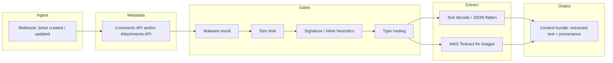

# Zendesk attachment content reading — strategy spec

This document captures the agreed approach for turning Zendesk ticket attachments into text that can join **overall issue context** (e.g. for triage or LLM-assisted workflows). It consolidates product decisions, Zendesk behavior, and MVP boundaries.

---

## 1. Purpose

**Goal:** When a support ticket includes attachments, reliably extract **usable text** (or structured text) from supported file types, attach it to downstream context building, and **avoid** pulling large binaries, unsafe files, or irrelevant images (e.g. email signature logos) into that context.

**Out of scope for initial delivery:** Full coverage of every file format; long-term archival of raw customer files unless policy requires it.

---

## 2. Principles

| Principle | Implication |
|-------------|-------------|
| **Zendesk remains source of truth** | We download for processing; we do not need to persist raw blobs for MVP if extracted text is enough. |
| **Metadata before bytes** | Use the Support API to learn **size**, **type**, and **malware status** before downloading. |
| **Process in memory** | Download to memory (or bounded stream), extract text, then **drop references** to raw bytes. Do not retain full payloads in logs. |
| **Defense in depth** | API pre-checks + streaming byte cap on download + malware gate. |
| **MVP first** | Narrow file types, clear skip rules, measurable limits; extend later. |

---

## 3. End-to-end flow (conceptual)

1. **Ingest:** Webhook provides at least **ticket id** and optionally attachment **filenames + URLs** (Liquid in trigger body must emit **valid JSON**, often using `| json` filters).
2. **Metadata:** Fetch **`GET /api/v2/tickets/{id}/comments.json`** (and/or **`GET /api/v2/attachments/{attachment_id}.json`**) to list attachments with **`size`**, **`content_type`**, **`file_name`**, **`malware_scan_result`**, **`inline`**, **`content_url`**, and nested **`thumbnails`**.
3. **Gates:** Apply malware policy, max size, signature heuristics, and type routing **before** expensive work (Textract) or large transfers.
4. **Extract:** Decode text for text-like types; run **AWS Textract** for allowed images.
5. **Output:** Append structured snippets to context (filename, attachment id, truncation flags, extractor id — **not** raw secrets).

---

## 4. Zendesk integration

### 4.1 Webhook payload (trigger-based)

- Triggers use **`notification_webhook`** with a **custom JSON body** and **Liquid** placeholders.
- Recommended fields: **`ticket.id`**, ticket summary fields as needed, and an **`attachments`** array built by looping **`ticket.comments`** (or **`ticket.public_comments`**) and **`comment.attachments`** with **`attachment.filename`** and **`attachment.url`**.
- String values should use Liquid’s **`| json`** so the HTTP body is **valid JSON** (handles quotes, newlines, empty fields).
- **`size`**, **`content_type`**, and **`malware_scan_result`** are **not** reliably available from Liquid alone; treat the **Comments API** as the source of truth for those.

### 4.2 Comments API (canonical metadata)

- **`GET /api/v2/tickets/{ticket_id}/comments.json`** returns each comment’s **`attachments[]`**.
- Per attachment, use at least:

  | Field | Use |
  |-------|-----|
  | `id` | Stable id for logs and idempotency |
  | `file_name` | Extension and display; parse extension with normal path rules (watch compound extensions). |
  | `content_type` | Route image vs text vs octet-stream |
  | `size` | **Bytes** — enforce max before download |
  | `content_url` | Authenticated download URL |
  | `inline` | Heuristic for signature vs “real” attachment (see §7) |
  | `malware_scan_result` | Gate downloads (see §5) |
  | `thumbnails` | **Do not process** as primary content (see §7) |

- The API may also expose **`url`** pointing at **`/api/v2/attachments/{id}.json`** for polling a single attachment.

### 4.3 Download authentication

- Use the same **Zendesk API authentication** as other REST calls when fetching **`content_url`** (per Zendesk guidance on URL properties — do not forward credentials to third parties).

---

## 5. Malware scanning

### 5.1 Result values (typical)

| `malware_scan_result` | Suggested handling |
|------------------------|--------------------|
| `not_scanned` | Scan not finished; **poll** with backoff + timeout (see below). |
| `malware_not_found` | Scan completed clean — **allow** processing (subject to other gates). |
| `malware_found` | **Do not** process as normal user content; skip / block per policy. |
| `failed_to_scan` | **Do not** treat as safe; skip, quarantine, or manual review — **not** the same as `malware_not_found`. |

### 5.2 Polling — no dedicated “scan complete” webhook

- Public Zendesk **event** catalogs do not document a first-class **“malware scan completed”** webhook.
- **Recommended:** After enqueue, **poll** attachment metadata (`comments` or **`GET /api/v2/attachments/{id}.json`**) until `malware_scan_result` is **not** `not_scanned`, or until a **max wait** elapses.
- Use **bounded exponential backoff** (e.g. start ~1–2s, cap total wait ~30–60s — tune to SLA).
- **Thumbnails** may show `not_scanned` while the **parent** is already `malware_not_found` — apply policy to the **attachment record you actually download**.

---

## 6. Size limits and download strategy

### 6.1 Why not “download first, then check size”?

- Full download before checking **wastes bandwidth and memory** and defeats the purpose of caps.
- **Prefer:** `size` from API **before** GET of `content_url`, then **reject** oversize attachments without downloading.

### 6.2 Safety net

- Even when `size` is trusted, use a **streaming download with a hard byte ceiling** (max bytes + 1 then abort) so bad metadata cannot exhaust memory.

### 6.3 Optional: HEAD request

- If **`Content-Length`** on **`HEAD`** is reliable in your environment, it can supplement metadata — **do not** rely on it as the only pre-check.

---

## 7. Filtering email noise (signatures, logos)

Email-originated tickets often include **small inline images** (logos, social icons). Reduce noise using **combined** heuristics (tune thresholds on real traffic):

1. **Never process `thumbnails[]`** — only the **primary** attachment records on each comment (skip nested thumbnail attachment objects unless explicitly needed).
2. **`inline` flag:** Useful but **not** sufficient alone (real screenshots can be inline). Combine with size/dimensions.
3. **Size:** Skip very small **`image/*`** files (e.g. below an N KB threshold — **calibrate**; too aggressive drops tiny but meaningful images).
4. **Dimensions:** If **`width` / `height`** exist on the attachment, skip very small dimensions typical of badges and icons.
5. **Deprioritization:** If both **inline** and **non-inline** attachments exist on the same ticket, process **non-inline** first; optionally skip small inline images entirely for MVP.

**Do not** run Textract on every image first and then filter — **too slow and costly**.

---

## 8. File types (MVP scope)

| Category | Types | Extraction approach |
|----------|--------|----------------------|
| Plain text | `.txt`, `.log`, many logs | Decode UTF-8 with fallback; **cap** max bytes/lines; mark truncated. |
| JSON | `.json`, `application/json` | Parse or pretty-print to text; cap size; handle non-UTF8 edge cases. |
| Images | `image/png`, `image/jpeg`, etc. | **AWS Textract** (enterprise) — after passing gates above. |
| **Deferred** | PDF, Office, archives, etc. | Phase 2+ unless product priority changes. |

**`application/octet-stream`:** Common for “unknown” uploads; use **extension** + **magic-byte sniffing** if added later; for MVP may **skip** or treat as text only when extension clearly matches allowed text types.

---

## 9. In-memory processing and lifecycle

- Download into **`bytes`** or **bounded stream** → extract → pass **extracted text** to context builder.
- **No temp file** required for MVP; if temp files are used later, **delete** in `finally`.
- After extraction, **release references** to raw bytes (`del` / scope exit) in long-lived workers to free memory promptly.
- **Do not** log raw attachment content; log ids, sizes, outcomes, and **hashes** if needed for deduplication.

**Persistence:** MVP stores **extracted text** (and metadata) in the application store (e.g. MongoDB) as needed — **not** raw binaries unless compliance requires object storage (e.g. S3) later.

---

## 10. AWS Textract (images)

- Use existing **enterprise** Textract integration patterns (sync vs async APIs per size/latency).
- Respect Textract **limits**; reject/downscale oversized images upstream.
- Textract is appropriate for **screenshots of UI/text**; quality varies for non-text photos.

---

## 11. Security and privacy (summary)

- Treat attachments as **untrusted input**; parsers should be **hardened** (e.g. XML/JSON bomb limits if applicable).
- Enforce **HTTPS** to Zendesk and AWS; **least-privilege** IAM for Textract and ECS tasks.
- Align **retention** of extracted text with company policy; **redact** PII if required before model context.

---

## 12. Operational notes

- Webhook delivery: design handlers to be **idempotent** where possible (duplicate deliveries).
- **Queue** (e.g. SQS) between webhook and worker recommended so Zendesk does not block on long extraction.
- **Observability:** structured logs with `ticket_id`, `attachment_id`, `outcome` (`skipped_malware`, `skipped_size`, `skipped_signature_heuristic`, `textract_ok`, `text_ok`, `error`).

---

## 13. Future enhancements (non-MVP)

- Additional extractors: PDF, `.docx`, etc.
- **S3** for raw bytes + lifecycle policies when audit or reprocessing is required.
- Stronger duplicate detection (e.g. perceptual hash for repeated logos).
- Zendesk **event** webhooks (separate from trigger webhooks) for alternate event shapes — evaluate if product needs unified event bus.

---

## 14. Open parameters (to calibrate in implementation)

| Parameter | Notes |
|-----------|--------|
| Max attachment bytes | Product + ECS memory limits |
| Malware poll max wait / backoff | Trade latency vs completeness |
| Min image size / dimension to skip | Tune on email-heavy tickets |
| Max extracted text per attachment | LLM context window and cost |

---

## 15. Document history

| Version | Summary |
|---------|---------|
| 1.0 | Initial spec from discovery: webhook + API metadata, malware polling, in-memory extraction, MVP types, Textract, signature heuristics, no raw-file retention for MVP |
